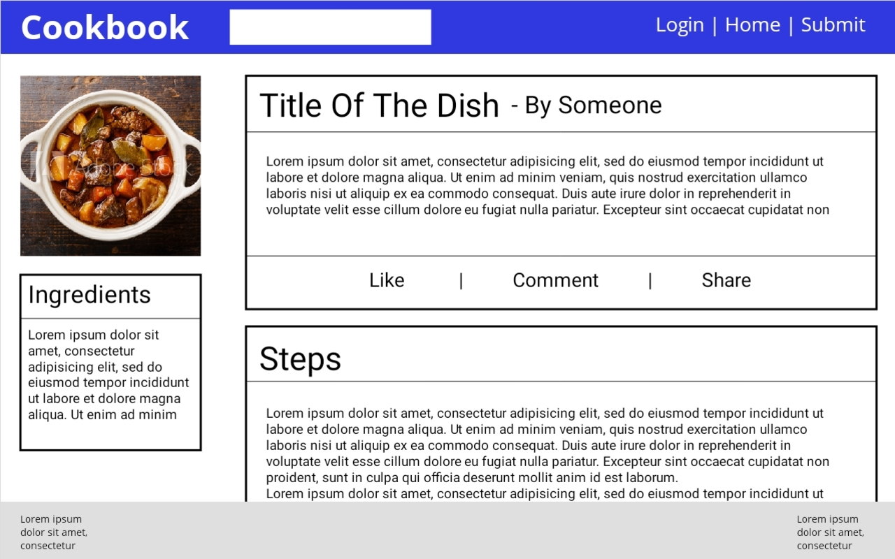

# Wireframes

The following images are the wireframes mocked up at the beginning of this project using Adobe Comp. It is quite clear that the design of this website borrows heavily from a certain popular social media site and so was referenced a lot when generating these wireframes and the site itself. Some things to note about the wireframes:
* All the wireframes are approximate, are not to scale and most of the text is placeholder text
* The mobile wireframes should all have the hamburger style button in the navigation bar
* The white box in the navigation bar is a search box

## Home Page

<table>
  <tr>
    <th>
      </img>
    </th>
    <th>
      </img>
    </th>
    <th>
      </img>
    </th>
  </tr>
  <tr>
    <td style="text-align:center">Desktop</td>
    <td style="text-align:center">Tablet</td>
    <td style="text-align:center">Mobile</td>
  </tr>
</table>
  

## Login Page

<table>
  <tr>
    <th>
      </img>
    </th>
    <th>
      </img>
    </th>
    <th>
      </img>
    </th>
  </tr>
  <tr>
    <td style="text-align:center">Desktop</td>
    <td style="text-align:center">Tablet</td>
    <td style="text-align:center">Mobile</td>
  </tr>
</table>
  

## User Page

<table>
  <tr>
    <th>
      </img>
    </th>
    <th>
      </img>
    </th>
    <th>
      </img>
    </th>
  </tr>
  <tr>
    <td style="text-align:center">Desktop</td>
    <td style="text-align:center">Tablet</td>
    <td style="text-align:center">Mobile</td>
  </tr>
</table>
  

## Recipe Form Page

<table>
  <tr>
    <th>
      </img>
    </th>
    <th>
      </img>
    </th>
    <th>
      </img>
    </th>
  </tr>
  <tr>
    <td>Desktop</td>
    <td style="text-align:center">Tablet</td>
    <td style="text-align:center">Mobile</td>
  </tr>
</table>
The desktop image is longer than the others to demonstrate the different types of inputs. The first box uses basic inputs or Select2 inputs, the second box can feature unlimited input rows which are added by clicking the Add input button. The in the second box the box with the - sign is the a delete input row button. All the views use the same basic layout but just compressed for smaller screens so were not included. Also the number of inputs is not necessarily consistent between views, they are only examples. Finally, in the color of the background should be the same in the first image.
  

## Recipe Page

<table>
  <tr>
    <th>
      </img>
    </th>
    <th>
      </img>
    </th>
    <th>
      </img>
    </th>
  </tr>
  <tr>
    <td style="text-align:center">Desktop</td>
    <td style="text-align:center">Tablet</td>
    <td style="text-align:center">Mobile</td>
  </tr>
</table>
  

## Search Page

<table>
  <tr>
    <th>
      </img>
    </th>
    <th>
      </img>
    </th>
    <th>
      </img>
    </th>
  </tr>
  <tr>
    <td style="text-align:center">Desktop</td>
    <td style="text-align:center">Tablet</td>
    <td style="text-align:center">Mobile</td>
  </tr>
</table>
  

## Contact/Changelog Page

<table>
  <tr>
    <th>
      </img>
    </th>
    <th>
      </img>
    </th>
    <th>
      </img>
    </th>
  </tr>
  <tr>
    <td style="text-align:center">Desktop</td>
    <td style="text-align:center">Tablet</td>
    <td style="text-align:center">Mobile</td>
  </tr>
</table>
  
